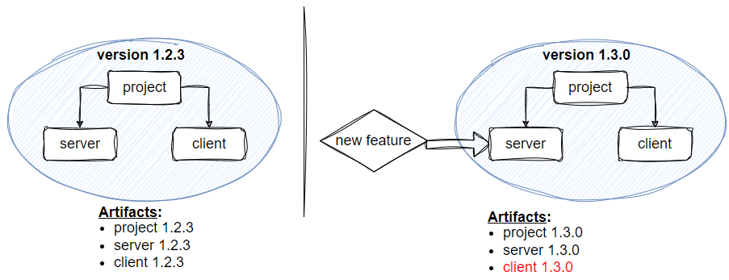
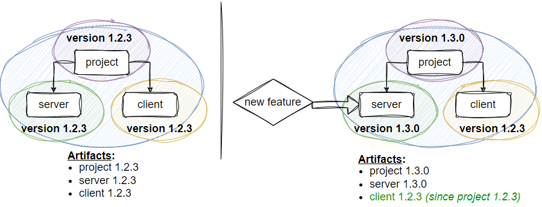
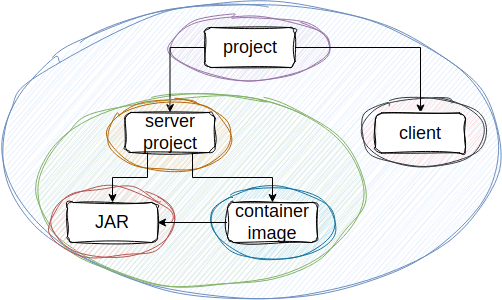
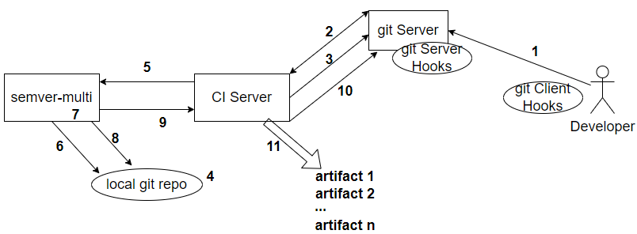

# semver-multi
[](https://labs.kineticfire.com/)
[](https://opensource.org/licenses/Apache-2.0)
<p></p>

Convey to your customers and team the granular differences between artifact versions with automatically-computed, artifact-level [standardized Semantic Versions](https://semver.org/) as part of your Continuous Integration & Continuous Delivery/Deployment (CI/CD) process, placing no additional burden upon the team other than writing [Conventional Commits](https://www.conventionalcommits.org/) compliant Git messages.

# Table of Contents
1. [Purpose](#purpose)
1. [Problem](#problem)
1. [Solution](#solution)
1. [Capabilities](#capabilities)
1. [Approach](#approach)
   1. [Semantic Versioning](#semantic-versioning)
   1. [Standardized Commit Messages](#standardized-commit-messages)
      1. [Scopes and Types](#scopes-and-types)
      1. [Well-Written Commit Messages](#well-written-commit-messages)
1. [Architecture](#architecture)
1. [Deploying](#deploying)
1. [Git Hooks](#git-hooks)
1. [Utilities](#utilities)
1. [Babashka](#babashka)
1. [License](#license)
1. [References](#references)
1. [todo](#todo)
   1. [Enforcing Standardized Commit Messages](#enforcing-standardized-commit-messages)
   1. [Identify Scopes and Types](#define-scopes-and-types)
   1. [Create and Install Config](#create-and-install-config)
   1. [Install Hooks](#install-hooks)
      1. [Server-side Hooks](#server-side-hooks)
      1. [Client-side Hooks](#client-side-hooks)
         1. [commit-msg](#commit-msg) 


# Purpose

*semver-multi* computes a version number for each configured artifact in a project, helping to more clearly express at a granular level the differences between versions of a given artifact.  Version numbers follow the [Semantic Versioning specification](https://semver.org/) to effectively indicate the meaning about artifact changes from one version to the next.  Standardized Git commit messages, adhering to the [Conventional Commits specification](https://www.conventionalcommits.org/), solely drive the semantic version increments in a methodical and objective manner.

Semantic versioning helps indicate the type and level of change between two different versions such as a new feature vs. a bug fix and backwards-compatible vs. non-backwards compatible updates.  However, typical versioning at the project-level does not provide insight into the nature or degree of changes (or lack thereof) at the artifact-level.

Artifact-level semantic versioning indicates to your customers and team the type and level of change between artifact versions.

Automatic artifact semantic versioning--powered by *semver-multi*--helps automate the accurate versioning of project artifacts, thereby accelerating your Continuous Integration & Continuous Delivery/Deployment (CI/CD) process.

*semver-multi* provides a light-weight semantic versioning capability that easily integrates into a CI/CD pipeline with a CI server, such as [Jenkins](https://www.jenkins.io/):
1. The CI server executes *semver-multi* with a file path to the local, updated Git repository.
1. There is no additional data that need be backed-up for recovery, beyond the Git repository.
   1. The Git repository stores all version information (in annotated tags) for the history of the project as well as the project definition (e.g., the `project-def.json`) at the time specific version information was generated
   1. *semver-multi* is stateless.  The system does not contain data to back-up for recovery purposes.
1. No additional Git commit is made to record versioning information (annotated tags are used).
1. *semver-multi* does not need to manage credentials or have access to remote systems.  The CI server (or other entity) is responsible for accessing the remote Git repository and, likely, managing credentials for that access.

# Problem

Figure 1 demonstrates the issue with a single version at the project-level for all artifacts.

<p align="center">
   
</p>
<p align="center">Figure 1 -- Multiple Artifact Versioning Problem</p>

When versioning all artifacts with a single project-level version, an artifact may reflect a version increment even though the artifact has not changed.  Figure 1 shows this scenario in which a new feature added to the `server` results in an increment of the `client's` minor version.

Unnecessary and innacurate version increments incorrectly represent the artifact as a new and (likely) improved version of the previous one.  The CI/CD pipeline and DevSecOps processes kick-off and culminate to distribute, store, and deploy an identical artifact to the previous version with no benefit.  Needless version increments can produce a ripple of equally unnecessary version bumps on dependent projects.  This effect can further compound "dependency hell", where developers find themselves caught between *version lock* and *version promiscuity* [1].

Customer experience may suffer, especially if the customer must exert effort to adopt a new version--applying their DevSecOps and distribution processes--that has no value beyond the previous version.

# Solution

*semver-multi* solves the [problem](#problem) of incorrectly conveying the generation of a new artifact (due to incrementing the version of an artifact when the artifact didn't change or didn't change to the degree indicated by the version increment) by computing a version for each configured artifact as shown in Figure 2.

<p align="center">
   
</p>
<p align="center">Figure 2 -- Multiple Artifact Versioning Solution with <i>semver-multi</i></p>

In this case, the `client` artifact did not change, so no version increment should be applied and the `client` remains at its original version.  For the `client`:  no DevSecOps processes kick-off, no ripple affects occur for dependent projects, likelihood of "dependency hell" is reduced, and customers save their own DevSecOps resources.

Figure 2 further illustrates the benefits and capabilities of granular artifact versioning with *semver-multi*.  In this scenario, we see that two projects--`JAR` and `container image`--constitute the `server project`.  The `server project` distributes the server in two forms to the user:  a JAR to be run on the JVM or a Docker image to run as a container with Docker Swarm, Kubernetes, or other container orchestration system.

<p align="center">
   
</p>
<p align="center">Figure 3 -- Granular Artifact Versioning Solution with <i>semver-multi</i></p>

Consider a scenario where developers add a new feature to the `container image`.  Without granular semantic versioning, both the container image and the JAR distributions (along with all of the other project artifacts) receive a version bump, though only the container image changed.  With granular semantic versioning by *semver-multi*, only the container image version is incremented but the JAR version remains the same.

# Capabilities

Primary capabilities provided by *semver-multi* include:
1. Automatic semantic version generation for multiple, independent project artifacts for 
   1. releases on the `main` branch (default) and/or other configured branches, in coordination with a CI server
   1. *developer* releases from the developer's machine, using scripts committed to the Git repository
1. Easy integration with the CI/CD pipeline and a CI server, such as [Jenkins](https://www.jenkins.io/)
1. Server and client-side Git hooks to enforce standardized Git commit messages

# Approach

Two tenets guide *semver-multi*:
1. [Semantic Versioning](#semantic-versioning)
1. [Standardized Commit Messages](#standardized-commit-messages)

## Semantic Versioning

*semver-multi* generates version numbers in accordance with the [Semantic Versioning specification](https://semver.org/).  The specification defines a set of rules and requirements that determines how a version number is incremented, which helps clearly indicate the nature and potential value and impact (e.g., new features or a backwards incompatible change) in a new artifact version.

A semantic version takes the form `<major version>.<minor version>.<patch version>` and increments the
- *major version* for backwards incompatible (e.g. breaking) changes
- *minor version* for added features that are backwards compatible
- *patch version* for backwards compatible bug fixes

A semantic version for a mainline release (such as from `main` in the git repository) may be `1.2.3`.  Given this version, then:
- a *bug fix* commit will result in a new version of 1.2.4
- a *new feature* commit will result in a new version of 1.3.0
- a *BREAKING CHANGE* commit will result in a new version of 2.0.0

*semver-multi* also supports development release versioning (which supports testing) whose semantic version takes the form `<major version from last main tag>.<minor version from last main tag>.<patch version from last main tag>-dev+<branch name>.<unique git object name>`.  Per the Semantic Versioning specification, the branch name will consist only of uppercase and lowercase letters, numbers, and dashes.  A development release version may be `1.2.3-dev+new-feature.gbba57`.

## Standardized Commit Messages

*semver-multi* requires git commit messages that follow the [Conventional Commits specification](https://www.conventionalcommits.org/).  The specification defines the format and content for commit messages.  Standardized commit messages allow *semver-multi* to understand commit messages and automatically generate the appropriate artifact-level version numbers.

The first line--the title line--is required and includes a *type*, *scope*, and *description*.
- *type*: The type of the commit, where *type* is an enumerated value that indicates the intent of the commit, e.g. a feature, bug fix, etc.  Required.
- *scope*: The scope of the commit, where *scope* is an enumerated value that indicates what is affected by the commit.  Required by *semver-multi*, although Conventional Commits says optional.
- *description*: Succintly describes the commit.  Required.

The optional body provides additional detail about the commit.
- If no body is provided, then the title line represents the entirety of the commit
- If a body is present, then an empty line must separate the title line from the body

A breaking change is indicated by either in the titlie line by an exclamation point after the closing parenthesis of the scope and before the colon e.g. `(<scope>)!: <description>`, by putting `BREAKING CHANGE: <description>` into the body, or both.

The general format of a commit message, following the rules described above, is:

```
<type>(<scope>): <description>

[optional body]
```

Example 1 - title line only (no body) without breaking change:
```
docs(project): correct misspellings and typos in README
```


Example 2 - title line only (no body) with breaking change:
```
feat(api)!: must include API token in all API queries
```


Example 3 - body without breaking change:
```
feat(app): allow users to register multiple contact email addresses

User may register more than email address.  Once verified, an email
address may be indicated as 'primary' for the user to login and to
receive email communications.
```


Example 4 - body with breaking change:
```
feat(app)!: user login requires username and not email address

User login identifies the user by configurable username and no
longer accepts an email address to identify the user

BREAKING CHANGE: user login requires username, and does not accept
email address
```

### Scopes and Types

The *scopes* and *types* in Conventional Commits act like objects and verbs to describe the project:  the *scope* indicates **what** changed, and the *type* indicates **how** it changed.  The scopes and types defined depend on the needs of the specific project.

*semver-multi* interprets the defined *scopes* and *types* in standardized commit messages to determine versioning information.

A *project* scope--perhaps shortened *proj*--can be used to apply to the entire project.  This scope is equivalent to no indicated scope, which is permissiable under Conventional Commits.  *semver-multi* requires a scope, even for project-level scope, so that commits to that level are explicitly considered.

Scope examples appear in Table 1.

<p align="center">Table 1 -- Generic Scope Examples</p>

| Generic Scope | Description with Specific Scope Examples |
| --- | --- |
| project | Applies to entire project (proj) or to sub-projects (client-proj, server-proj) |
| code | Application (app), library (lib), API (api), container image (img), Ansible playbooks (infra), etc. |
| document | README (readme), user guide, developer guide, etc. |

Table 2 provides type examples.  Note that not every type will apply for every scope.

<p align="center">Table 2 -- Type Examples</p>

| Type | Description | Generic Scope | Triggers Build | Minor or Patch<sup>1</sup> | Change propogates up the heirarchy only? |
| --- | --- | --- | --- | --- | --- |
| revert | Revert to a previous commit version.  Applies only to top-level project. | project | yes | minor | Change propogates down from the root project<sup>2</sup> |
| feat | Add a new feature | code | yes | minor | yes |
| more | Add code for a future feature (later inidicated as complete with 'feat').  Support branch abstraction. | code | yes | minor | yes |
| change | Change implementation of existing feature | code | yes | patch | yes |
| remove | Remove a feature | code | yes | minor | yes |
| less | Remove code for a feature (already indicated as removed with 'remove').  Support branch abstraction. | code | yes | minor | yes |
| deprecate | Indicate some code is deprecated | code | yes | patch | yes |
| fix | Fix a defect (e.g., bug) | code | yes | patch | yes |
| refactor | Rewrite and/or restructure code without changing behavior | code | no | patch | yes |
| perf | Improve performance, as a special case of refactor | code | yes | minor | yes |
| security | Improve security aspect | code | yes | minor | yes |
| style | Does not affect the meaning or behavior | code | no | patch | yes |
| test | Add or correct tests | code | no | patch | yes |
| struct | Project structure, e.g. directory layout | project | yes | patch | yes |
| docs | Affect documentation.  Scope may affect meaning.  When applied to 'code', affects API documentation (such as documentation for public and protected methods and classes with default javadocs) | project, code, document (e.g., README), etc. | no | patch | yes |
| idocs | Affect internal documentation that wouldn't appear in API documentation (such as comments and documentation for private methods with default javadocs)  | code | no | patch | yes |
| build | Affect build components like the build tool | project, code | no | patch | Change propogates down to all leaf projects/artifacts, then up<sup>3</sup> |
| vendor | Update version for dependencies and packages | project, code, etc. | yes | patch | Change propogates down to all leaf projects/artifacts, then up<sup>3</sup> |
| ci | Affect CI pipeline | project, code | no | patch | Change propogates down to all leaf projects/artifacts, then up<sup>3</sup> |
| ops | Affect operational components like infrastructure, deployment, backup, recovery, etc. | project, code | yes | patch | yes |
| chore | Miscellaneous commits, such as updating .gitignore | project, code | no | patch | yes |

1. *Unless indicated as a breaking change, then is 'major'*
1. *Reverting a project may affect the entire project and so all project/artifact version numbers are affected.  A Git tag with a version update may be performed immediately after a 'revert' to custom-set versioning information.*
1. *Changes to the build, vendor dependencies (provider and/or version), and continuous integration pipeline definitions tend to propogate to all descendents*


Table 3 defines type modifiers.

<p align="center">Table 3 -- Type Modifiers</p>

| Modifier | Description |
| --- | --- |
| ~ | The tilde character may be prefixed to a type to indicate a work-in-progress |


### Well-Written Commit Messages

Though not required by *semver-multi*, well-written **content** of commit messages helps developers understand the changes made to the repository; this is especially when tracking down regressions.  Good commit messages also support the validation of changelogs and release notes.

A good commit message:
- is **atomic**.  Good Commits align to the Single Responsibility Principle where, in this case, a unit of work covered by the commit should concern itself with one task.  This approach helps simplify the process of tracing regressions and corrective actions like reverting.  While atomic commits may introduce some drag with requiring work to be planned and split into smaller chunks, it can improve the overall quality and simplify debugging and corrections related to the repository.
- uses **imperative mood** in the subject line, as if in the tone of giving a command or order, e.g. "Add fix for user active state."
- addresses the **why** and **how** a change was made.
- has a description in the title line (first line) as if **answering "This change will <description>."**
- has a body that covers the **motivation for the change and contrasts with previous behavior**.
- uses lowercase and no punctuation in the subject.
- limits the first line to 50 characters and body lines to 72 characters each

# Architecture

Figure 4 shows the system architecture of *semver-multi* as integrated into a CI/CD pipeline.  The figure also illustrates the interaction of *semver-multi* with a CI server, such as [Jekins](https://www.jenkins.io/).

<p align="center">
   
</p>
<p align="center">Figure 4 -- <i>semver-multi</i> Architecture</p>

*semver-multi* generates artifact-level version numbers in coordination with the CI server as follows:
1. Developers push to the git server commits aligning to the [Conventional Commits specification](https://www.conventionalcommits.org/) and preferably enforced by git hooks (todo link)
   1. Server-side and/or client-side git hooks may be used.  Server-side hooks are preferred since they are easier to install and enforce and more difficult to bypass.  Client-side hooks may help the developer before server-side hooks come into play.  Client-side hooks may be the only option if server-side hooks cannot be installed.
1. The CI server becomes aware of new commits to the repository such as through a push notification, poll, or manual trigger
1. The CI server retrieves the current contents of the repository by performing a `git checkout` or `git pull` of the repository
1. A local version of the git repository is now on the filesystem with the CI server and accessible to *semver-multi*
1. The CI server, in the course of building the project in the repository, requests that *semver-multi* generate version numbers for the build
1. *semver-multi* retrieves from the local copy of the git repository on the filesystem
   1. The last git tag number
   1. The annotation in the last git tag, which contains the versions for the project and its artifacts for the last build
   1. The commit message log from the last git tag to current
   1. The `project-def.json` (todo link) which describes the project, its sub-projects and artifacts, and their relationships
1. *semver-multi* computes the new version numbers for the build
1. *semver-multi* creates a new annotated git tag with the updated versions
1. *semver-multi* provides a response to the CI server that includes the updated versions for the project and its artifacts
1. The CI server pushes the new git tag
1. The CI server injects the version numbers as it builds, tests, and delivers/deploys the project artifacts

Note that the process neither changes the contents of the project nor produces additional commits.

## Primary Integration Points for Version and Tag Coordination

*semver-multi* coordinates version information and corresponding git tags as follows:
1. The git server retains all of the version information and corresponding git tags.  The git tag corresponds to the project-level version.  All other version information is stored as JSON data in the annotated git tag.
1. The `project-def.json` describes the project, its sub-projects and artifacts, and their relationships.  The file is stored in the git repository (by default, at the root level).
1. The CI server (or other entity) requests that *semver-multi* generate version information given a file path to a local git repository.  *semver-multi* creates git tags in the local repository with JSON data to record the updated version information and responds to the CI server with JSON version data.  The CI server must push the git tags and apply the version information to the build.

*semver-multi* provides a light-weight semantic versioning capability that easily integrates into a CI/CD pipeline with a CI server:
1. The CI server simply executes *semver-multi* with a file path to the updated repository
1. There is no additional data that need be backed-up for recovery, beyond the git repository.
   1. The git repository stores all version information (in annotated tags) for the history of the project as well as the project definition (the `project-def.json`) at the time specific version information was generated.
   1. *semver-multi* is stateless.  The system does not contain data to back-up for recovery purposes.
1. No additional commit is made to record versioning information (annotated tags are used).
1. *semver-multi* does not need to manage credentials or have access to remote systems.  The CI server (or other entity) is responsible for accessing the remote git repository and, likely, managing credentials for that access.

# Deploying

todo


# Git Hooks

*semver-multi* provides Git hooks to facilitate semantic versioning.  The client and server-side `commit-msg-enforcement` scripts are particularly important as they help ensure standardized Git commit messages.

Ideally, both server-side and client-side hooks would be used.  Server-side hooks are easier to ensure enforcement as they need only be deployed and managed in one place (e.g., the server) and not installed for every development environment; server-side hooks are also more difficult to bypass than client-side hooks.  However, server-side hooks require admin or root control of the server hosting the git repository, in which case client-side hooks are the only option.

Even with server-side hooks, client-side hooks can add some benefit for developers such as helping to warn of some condition locally before attempting to push such issues to the remote server.

| Purpose | Client or Server-Side | Git Hook Name | Script Name | Configuration? |
| --- | --- | --- | --- | --- |
| Enforce standardized Git commit messages | client-side | commit-msg | commit-msg-enforcement | Uses `project-def.json` |
| Prevent rebasing, which destroys commit history | client-side | pre-rebase | prevent-rebase | none |
| Warn when committing to 'main' | client-side | pre-commit | warn-commit-branch | none |
| Warn when pushing to 'main' | client-side | pre-push | warn-push-branch | none |


## Using Git Hooks

### Install Babashka

See [Babashka](#babashka).

### Install Client-side Git Hooks

Copy the script(s) to the client's `<git repository>/.git/hooks`

Make the script(s) executable with `chmod +x <script name>`


# Utilities

*semver-multi* provides utility scripts.

| Purpose | Script Name |
| --- | --- |
| Validate, display, and query the `project-def.json` | semver-def-display |
| Create, update, and validate project version data for the Git tag | semver-ver |


## Using the Utilities

### Install Babashka

See [Babashka](#babashka).

### Install the Utilities

Copy the script(s) to a directory, such as `~/semver-multi/util` 

Make the script(s) executable with `chmod +x <script name>`

Put the path to the script(s) in your path by adding this line to your `~.bashrc`: `export PATH="$HOME/semver-multi/util:$PATH"`

# Babashka

The [Git hooks](#git-hooks) and [utilities](#utilities) provided by *semver-multi* are implemented in Babashka, a native Clojure interpreter for scripting.  Use the [Babashka GitHub installation](https://github.com/babashka/babashka?tab=readme-ov-file#quickstart) instructions to install Babashka.

See the [Babashka site](https://babashka.org/) or the [Babashka GitHub](https://github.com/babashka/babashka) for further details on Babashka. 

# License
The git-conventional-commits-hooks project is released under [Apache License 2.0](https://www.apache.org/licenses/LICENSE-2.0)


# References
1. [Semantic Versioning 2.0.0](https://semver.org/), downloaded 7 Apr. 2024.


# todo

1. [Enforce Stnadardized Commit Messages](#enforce-standardized-commit-message)
1. [Define Scopes and Types](#define-scopes-and-types)
1. [Create and Install Config](#create-and-install-config)
1. [Install Hooks](#install-hooks)


## Enforce Standardized Commit Messages

*semver-multi* provides git hooks (todo link) to help enforce standardized git commit messages.  The integrity of the git commit messages is key to understanding the changes in the project and generating the appropriate version information.

Server-side and/or client-side git hooks may be used.  Server-side hooks are preferred since they are easier to install and enforce and more difficult to bypass.  Client-side hooks may help the developer before server-side hooks come into play.  Client-side hooks may be the only option if server-side hooks cannot be installed.

## Define Scopes and Types

Identify the scopes and types to be used for the project.

Beginning with scopes, consider:
- What artifacts are produced?
- What needs to be individually versioned?


## Create and Install Config

Using the scopes and types identified above, create a configuration file named ```commit-msg.cfg.json``` and commit it to the top-level of your repository.  The configuration file should follow the format shown below, although *scopes* and *types* will vary.

Table 3 -- Descripton of Select 'commit-msg.cfg.json' Properties
| Property | Description |
| --- | --- |
| enabled | *true* to enable the hook enforcing commit message standard and *false* to disable; server-side hooks may be configured to always enforce the commit message standard regardless of this setting |
| length.titleLine | Sets the minimum (*.min*) and maximum (*.max*) number of characters for the title line (first line) of the commit message |
| length.bodyLine | Sets the minimum (*.min*) and maximum (*.max*) number of characters for a line in the body of the commit message |

```
{
   "enabled": true,
   "length": {
      "titleLine": {
         "min": 20,
         "max": 50
      },
      "bodyLine": {
         "min": 2,
         "max": 72
      }
   },
   "scopes": [
      {
         "name": "proj",
         "types": [
            "revert",
            "security",
            "build",
            "vendor",
            "ci",
            "docs",
            "ops",
            "chore"
         ]
      },
      {
         "name": "app",
         "types": [
            "feat",
            "more",
            "change",
            "fix",
            "deprecate",
            "remove",
            "less",
            "refactor",
            "perf",
            "security",
            "style",
            "test",
            "docs",
            "build",
            "vendor",
            "ci",
            "ops",
            "chore"
         ]
      },
      {
         "name": "readme",
         "types": [
            "docs"
         ]
      }
   ]
}
```


